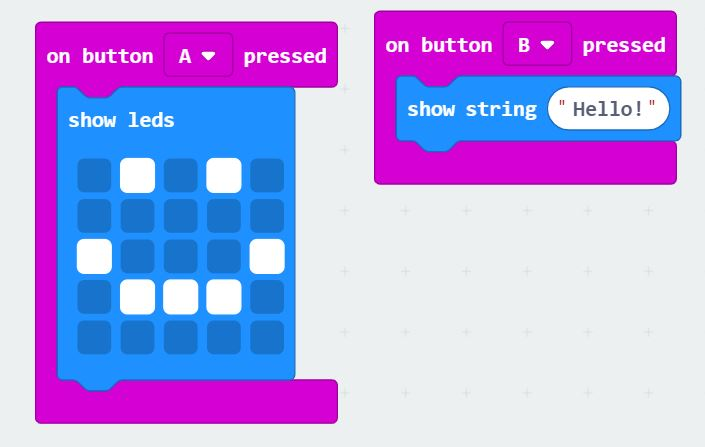

# Inventor Kit Experiments

*Markdown reference: https://guides.github.com/features/mastering-markdown/*

## Instructions ##

*For a selection of 5 inventor kit experiments that you choose, fill out the following sections.

### Experiment 1: Say "hello" to the BBC micro:bit ###

#### Photo of completed project ####

(Insert a caption here)

#### Reflection ####

This experiment was really useful to familiarise and introduce me to the micro:bit. I got a feel for how the interface works and tried out some of the options available to me. I learnt that the micro:bit follows the idea of inputs and outputs, if you do A, B will happen. 

As for real world application, this experiment could relate to keyboards, where you press a key and a letter is displayed, or a scanner at a store where a barcode is scanned and an item is registered. 

### Experiment 2: Using a light sensor & analog inputs ###

#### Photo of completed project ####

<video src="20200314_191809.mp4" poster="nightlight.jpg" width="320" height="200" controls preload></video>

(Insert a caption here)

#### Reflection ####

In this experiment, something new to me was or something I learned was (insert something here).

This experiment could be the basis of a real world application such as (insert something here).

### Experiment name ###

(Replace this with the experiment name)

#### Photo of completed project ####
In the code below, replace imagemissing.jpg with the name of the image, which should be in the kitexperiments folder.

(Insert a caption here)

#### Reflection ####

In this experiment, something new to me was or something I learned was (insert something here).

This experiment could be the basis of a real world application such as (insert something here).

### Experiment name ###

(Replace this with the experiment name)

#### Photo of completed project ####
In the code below, replace imagemissing.jpg with the name of the image, which should be in the kitexperiments folder.

(Insert a caption here)

#### Reflection ####

In this experiment, something new to me was or something I learned was (insert something here).

This experiment could be the basis of a real world application such as (insert something here).

### Experiment name ###

(Replace this with the experiment name)

#### Photo of completed project ####
In the code below, replace imagemissing.jpg with the name of the image, which should be in the kitexperiments folder.

(Insert a caption here)

#### Reflection ####

In this experiment, something new to me was or something I learned was (insert something here).

This experiment could be the basis of a real world application such as (insert something here).

