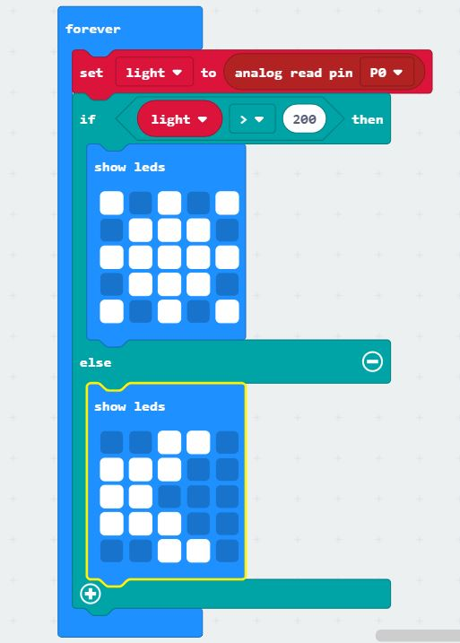

# Inventor Kit Experiments

*Markdown reference: https://guides.github.com/features/mastering-markdown/*

## Instructions ##

*For a selection of 5 inventor kit experiments that you choose, fill out the following sections.

### Experiment 1: Say "hello" to the BBC micro:bit ###

#### Photo of completed project ####

micro:bit will display a :) emoji when button A is pressed, and will write the words, "hello!" when button B is pressed.

#### Reflection ####

This experiment was really useful to familiarise and introduce me to the micro:bit. I got a feel for how the interface works and tried out some of the options available to me. I learnt that the micro:bit follows the idea of inputs and outputs, if you do A, B will happen. 

As for real world application, this experiment could relate to keyboards, where you press a key and a letter is displayed, or a scanner at a store where a barcode is scanned and an item is registered. 

### Experiment 2: Using a light sensor & analog inputs ###

#### Photo of completed project ####

<video src="20200314_191809.mp4" poster="nightlight.jpg" width="220" height="300" controls preload></video>

#### Reflection ####

In this experiment, I was first introduced to the breadboard, along with phototransistors, resistors, and jumper wires. I also learnt about analog readings.
To summarise what I learnt:
A phototransistor can detect light levels. There is also a small phototransistor on the micro:bit. The jumper wires connects the circuit from 0V to 3V. The more light on the phototransistor, the more electricity in can conduct.  When the light level goes down, the resistor helps pull the amount of voltage down to 0. 

Analog reading:
The amount of voltage on a pin is read and converted to a number between 0 and 1023. This is then used in the coding with an 'if' statement to create an output over a certain threshold.

This experiment could apply to phones that use light sensors to dim or brighten a screen automatically according to the light level it detects. They could also be used to gather data about how much light is in a certain area, where a counter records every time the light level exceeds a certain threshold. It could also be used to detect the absense of light due to shadow. For example, a phototransistor using a similar LED display could display an image every time a box is opened, because opening the box would expose the phototransistor to the light.

### Experiment 3: dimming an LED using a potentiometer###

#### Photo of completed project ####

<video src="20200314_182846.mp4" poster="20200314_182811.jpg" width="220" height="300" controls preload></video>

#### Reflection ####

In this experiment, I learnt how the potentiometer works and how to have two loops working concurrently. The potentiometer can conduct voltage at varying degrees by turning the dial, doing so by changing the bursts of voltage it conducts. One of the two loops remembers whether or not the light is on (with 0 meaning off and 1 meaning on) using the button (connected to P0). The second loop then, if the light is on, writes P2 (the LED) to whatever voltage the potentiometre is conducting. If the light is off, the display of the LED goes to 0 (off).

Potentiometres could be used with dimming lights, but also controlling volume on things like radios. This can also work with the brightness of devices.

### Experiment 4: Using a transistor to drive a motor ###

(Replace this with the experiment name)

#### Photo of completed project ####
In the code below, replace imagemissing.jpg with the name of the image, which should be in the kitexperiments folder.

(Insert a caption here)

#### Reflection ####

This experiment introduced me to motors. Motors maintain their speed via a 'duty cycle', where at very high speeds, the motor will be activated at either 3V or 0V at differentiating times. For example, to speed the motor up, the transistor will be left on for a slightly longer time than it is off. 
The second loop, while the speed of the motor is less than 1023, will write P0 to the 'duty' variable and then set the variable to be duty+1, and then pause. This basically means the speed of the motor will increase by 1, pause for 10ms, and do so again continually until it reaches 1023, and will then decrease by 1 until it is less than 1023 and the loop will continue.

This experiment could be the basis of a real world application such as (insert something here).

### Experiment 5: Using the accelerometer to control motor speed ###

(Replace this with the experiment name)

#### Photo of completed project ####
In the code below, replace imagemissing.jpg with the name of the image, which should be in the kitexperiments folder.

(Insert a caption here)

#### Reflection ####

In this experiment, something new to me was or something I learned was (insert something here).

This experiment could be the basis of a real world application such as (insert something here).

### Experiment 6: Setting the tone with a piezo buzzer ###

#### Photo of completed project ####
In the code below, replace imagemissing.jpg with the name of the image, which should be in the kitexperiments folder.

<video src="20200321_094401.mp4" poster="20200321_094357.jpg" width="220" height="300" controls preload></video>

(Insert a caption here)

#### Reflection ####

In this experiment, I was first introduced to the piezo buzzer. What's really interesting about this is how you can control the tone of the buzzer with the micro:bit. I also enjoyed experimenting with the different patterns available.

I could see this buzzer being useful as a form of audible feedback for things like buttons. It could also be used for an alarm, where the clock reaching a certain time would activate the buzzer. If you did't have access to an actual digital clock, you could also use a counter to the same effect. 

### Experiment 7: Wind power ###

#### Photo of completed project ####
In the code below, replace imagemissing.jpg with the name of the image, which should be in the kitexperiments folder.

(Insert a caption here)

#### Reflection ####

In this experiment, something new to me was or something I learned was (insert something here).

This experiment could be the basis of a real world application such as (insert something here).

### Experiment 8: Making a game using the compass ###

#### Photo of completed project ####
In the code below, replace imagemissing.jpg with the name of the image, which should be in the kitexperiments folder.

<video src="20200321_104407.mp4" poster="20200321_104355.jpg" width="220" height="300" controls preload></video>
#### Reflection ####

In this experiment, I had some experience with working in javascript. I learnt just how particular you need to be with writing it! I also found that the 'Math.random(360)' didn't work, so after looking at the information for this experiment online, I found that I could use 'Math.randomRange (0, 360)' instead. This one I found surprisingly easy to understand. I learnt about the 'absolute' function, which just means all integers are positive. The way the light goes faster or slower depending on how large the difference was between the goal and the angle of the micro:bit was really interesting. 

This experiment could absolutely be the basis of a toy. It reminds me of Furbys where they would eventually turn evil if you held them upside down for too long. The compass would be useful in phones for apps that use maps, or GPS navigation equipment.

