# Assessment 1: Replication project

*Markdown reference:* [https://guides.github.com/features/mastering-markdown/](http://guides.github.com/features/mastering-markdown/)

## Temperature gauge ##

## Related projects ##

### Related project 1 ###
Heated Travel Mug

https://www.summitracing.com/parts/prn-pi-4121red

This is a relatively simple product, but it still is useful to see how one can apply a gauge to different products. This product seems to tell the user what the temperature of the drink is before the user drinks it. This temperature gauge would apply well to a kettle, to see how long it takes until boiling.

### Related project 2 ###
Temperature Necklace

https://www.hackster.io/Tahani2016/temperature-necklace-4153b6

I really like this. It combines the temperature detection with a cool visual glow from the necklace. The project really plays into the idea of a magical necklace, and makes the object very appealing. The necklace itself also looks fantastic and works wonderfully with the fantasy theme. 

### Related project 3 ###
Indoor NeoPixel Thermometer 

https://create.arduino.cc/projecthub/hackerEsk/indoor-neopixel-thermometer-64f22e?ref=tag&ref_id=temperature&offset=56

This is a different form of temperature gauge project using similar technology to the micro:bit. I like the idea of using neopixels as an interesting visual way to communicate temperature. 
Update as of 18/03/2020: Since I am unable to come into class to use neopixels, and will be moving back to the Sunshine Coast next week, it is unlikely I will be able to procude these, so I'll have to use something else. However, I do really like the idea of a visual demonstration of temperature using lights, so perhaps I could find a way to use the LEDs that come with the micro:bit. 

### Related project 4 ###
Weather Wand

https://create.arduino.cc/projecthub/Dan/weather-wand-c100cb?ref=tag&ref_id=temperature&offset=59

This project is related to mine because it uses temperature readings, but in a really interesting and creative way. In its description, the creator mentions the project being: "[A way] to make the invisible visible." The project involves a Neopixel LED attached to a stick, which the creator used to draw patterns in the air. However, a temperature sensor attached also to the stick detected the temperature, and this was turned into a value that created the colour of the stick. The creator then drew patterns in the air with it. I like the use of the Neopixels, and it's making me consider what I can do with light and temperature. 
This project also demonstrates the effects of a higher temperature by placing the project near an oven. I might do the same. 

### Related project 5 ###

When I was in primary school one of my friends had one of these things and I was obsessed with it. When you pressed a button, a random animal showed up. There was nothing I found more entertaining, which possibly said more about me than the watch. Regardless, I think there’s something interesting there about displays that typically don’t show fun things being able to do so when you press a button. I’ve noticed the micro:bit includes various prebuilt emojis, so perhaps I could use them.
### Related project 5 ###
Traffic Lights

https://learn.adafruit.com/micro-bit-lesson-2-controlling-leds-on-breadboard?view=all

This project is related to mine because I am now planning on using three lights in a similar format. I have replicated this project as a beginning platform for my project to evolve from. 

### Related project 6 ###
BBC Micro:bit – Water on the Floor - Sensor Alarm

https://www.element14.com/community/community/stem-academy/microbit/blog/2018/10/18/project-bbc-microbit-water-on-the-floor-sensor-alarm

I like the idea of using the temperature gauge instead as an alarm of some sort. This project was inspired by some whose sink constantly leaked, and needed a way to let themselves know that it leaked before it floods the cupboard. I think I could do something similar but with temperature.

## Reading reflections ##
*Reflective reading is an important part of actually making your reading worthwhile. Don't just read the words to understand what they say: read to see how the ideas in the text fit with and potentially change your existing knowledge and maybe even conceptual frameworks. We assume you can basically figure out what the readings mean, but the more important process is to understand how that changes what you think, particularly in the context of your project.*

*For each of the assigned readings, answer the questions below.*

### Reading: Don Norman, The Design of Everyday Things, Chapter 1 (The Psychopathology of Everyday Things) ###

*What I thought before:*

I imagined a designer to be purely conceptual, someone who writes and draws up plans to give to someone else to create.

*What I learned:*

I learnt that being a designer entails actually creating a prototype of the product, with all the coding and technical knowledge that comes with. It wals really interesting to learn about the designer skillset, which I previously had no idea of, which has to be large to complete a project, but is powered by curiosity. I also learnt that the skills involved with being a designer are constantly evolving, as well as your projects. The most impactful part was reading in the case study about the author learning to use Processing.There have been many occasions where I was too intimidated to learn new programs and coding languages because I always feel like I'm starting from nowhere, and aren't smart enough to grasp these complex concepts I read about. However, in the article, the author mentions they had to spend a "couple of hours of installing libraries and looking up error messages in Google". Whilst, consciously, I always knew that everyone had to start from somewhere, the fact that this very accomplished and successful person was googling error codes really made it sink it. The fact that most of your knowledge will come from learning from the online community is really reassuring, even as a professional, is really reassuring, and has changed how I see designers. 

*What I would like to know more about:*
I'd really like to learn more about the blob-tracking technology that was mentioned. It sounded really interesting. 

*How this relates to the project I am working on:*
This reading, in particular the case study, has taught me the value of the process of projects. I really do need to use all the resources online that I can to constantly be trying to improve my project, because there is always small room for improvement. 

### Reading: Chapter 1 of Dan Saffer, Microinteractions: Designing with Details, Chapter 1 ###

*What I thought before: Describe something that you thought or believed before you read the source that was challenged by the reading.*

*What I learned: Describe what you now know or believe as a result of the reading. Don't just describe the reading: write about what changed in YOUR knowledge.*

I've been aware of the importance of small details for products for a while, like how things as simple as font choices can impact one's interaction with a program, but never had any idea to the extent of that importance. The idea of a product being simply a microinteraction is really interesting, and not something I had even considered before. I also now know more details about how microinteractions work, their process, . The idea of feedback was really interesting, with how rules are invisible unless specified. There's something really interesting about how designers need to, using culturally understood symbols and relationships, communicate a message as simply as possible. 

*What I would like to know more about:*
I would like to learn more about different types of microinteractions to use for my projects and how to implement them. Next time I find a cool project I'm interested in, I will need to have a closer look at the microinteractions they implement. 

*How this relates to the project I am working on: Describe the connection between the ideas in the reading and one of your current projects or how ideas in the reading could be used to improve your project.*

This really makes me consider the user's point of view. For every component I design, I need to think about how it would affect the user: postively, negatively, or not at all.

### Reading: Scott Sullivan, Prototyping Interactive Objects ###

*What I thought before: Describe something that you thought or believed before you read the source that was challenged by the reading.*

*What I learned:*

I really liked how the reading mentioned the importance of understanding to the user.
 Whilst before the reading I was aware feedback was important, I did not know the danger of badly-implemented feedback. (Such as overwhelming lights and noises etc.) Conceptual models was something I previously had little to no knowledge about. I now know that how you represent information is about constructing a fake, simpler, easy to understand model to present to your user. Hence, I suppose, the name 'conceptual model'. It is very unlikely a user will understand precisely how your project works, or will even want/need to know. So it is important to create an analogy to explain it, in a way that's intuitive. It is also critical that this analogy is correct. If it falls apart in some aspects, it will result in confusion of the user because the technology did not work in the way they expected it to. A critical part of design is telling users how to use the technology, with as little handbook guidance as possible. 

*What I would like to know more about: Describe or write a question about something that you would be interested in knowing more about.*

*How this relates to the project I am working on: Describe the connection between the ideas in the reading and one of your current projects or how ideas in the reading could be used to improve your project.*

## Interaction flowchart ##
*Draw a flowchart of the interaction process in your project. Make sure you think about all the stages of interaction step-by-step. Also make sure that you consider actions a user might take that aren't what you intend in an ideal use case. Insert an image of it below. It might just be a photo of a hand-drawn sketch, not a carefully drawn digital diagram. It just needs to be legible.*

## Process documentation

Here are some notes from my initial idea planning phase.

Since I wanted to include three flashing lights, I searched for some projects that would use them to base my research off of. I ended up finding [this](https://learn.adafruit.com/micro-bit-lesson-2-controlling-leds-on-breadboard?view=all) one. I wrote more information about it in the project research above. I also replicated the project below.

 
My current idea is to create a temperature detector using LEDs as visual communicators of the temperature. This project will be a small, rectangular box, which will, in the final product, be made of a weather-proof plastic, and will have anti-slip stoppers. Its purpose is to be placed on an outdoor table or windowsill, in the view of a window, for a quick look at what the temperature is outside. This is mainly for choosing outfits - should I wear something warmer today, or something colder? I often find that, even though it is so easy to step outside onto a balcony, I usually just guess what the temperature is like and dress appropriately, causing many situations where I'd leave the house and end up sweating or freezing. This product has to be so simple that its easier than walking outside or looking the temperature up on Google, so I made it a simple visual cue. Whilst I only have certain coloured LEDs, in an idealised product the colours would be: red for warm, yellow for room temperature and blue for cold. However, I will substitute green in for blue. 
I plan on using the micro:bit, breadboard and alligator clips to make the box as portable as possible. I will also need to design with the jumper cables attached to the breadboard in mind.
.jpg

I would like to have the micro:bit visible on the side to use the A button as an on/off switch, and also to display the temperature on the screen. However, I need to use the B button for something, and I wasn't sure what. I then remembered the Baby G watch and its animals that came onscreen from pressing a button (more info in the 'related projects' section. Since this project is more ornamental, such a feature could suit it. It is always fun to be able to customise things, and I could imagine the potential within social media to pair a particularly hot or cold temperature with a sad or happy face on a photo. It could also just make for some cute decoration: when you don't want to see the temperature, having a box sporting a love heart on your window sill would be really cute. I'm not too confident in the idea, but I know that for myself, I would love that feature a lot.
Here's the code!

Surprise! Due to a change in livng circumstances, I no longer have access to alligator clips, so I'm going to have to rework my design a bit to accomadate for the prototyping plate.
I've decided instead to create a form of pre-smoke detector. Whilst most homes come with a fan for the bathroom, the aparmtment I moved into in Brisbane didn't, so I have had a couple of run-ins with the smoke detector. This becomes even more of a problem in an apartment complex, where if I didn't turn it off fast enough, the whole complex would have to be evacuated. Alarms can also irritate the other people you live with, and pets if you have them. This also can be useful for if you forget to turn the fan on, or particularly, warning the user when the dryer is too hot. Essentially, it's another smoke detector, but with a lower temperature threshold to prevent the louder alarm from ringing due to false positives.

Here is my research on smoke detectors:
https://www.nfpa.org/Public-Education/Staying-safe/Safety-equipment/Smoke-alarms/Ionization-vs-photoelectric
https://ifpmag.mdmpublishing.com/alarmed-about-steam/
https://homeguides.sfgate.com/steam-make-smoke-detector-off-85036.html
And here are my notes:
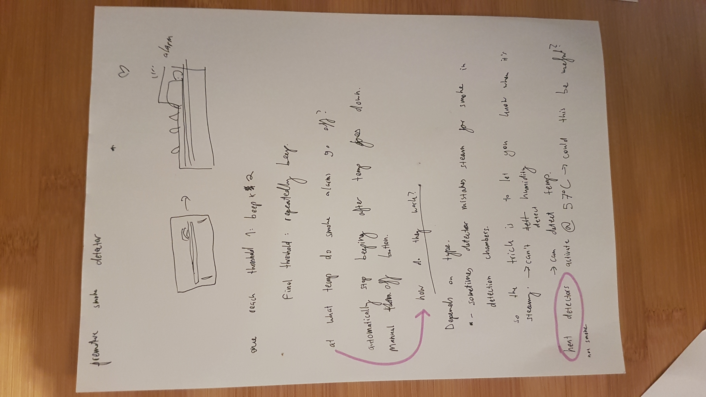

Essentially,all I need to do now is modify the traffic lights to my project. This includes adding an on button and a buzzer.

I now had to apply the temperature readings to the lights. I set the temperature to a variable of the same name, and then added an 'if then else' statement for the three temperature ranges.
To figure out what the temperature threshold had to be, I brought a thermometre into the bathroom and had a shower without the fan on to see what temperature the alarm would go off. (I had a chair under the alarm to be ready) After a very stressful experiment, the thermometre read about 36 degrees celsius. So I am going to use this data for my project. If I had to re-do this in the future, I would do more experiments, as well as experiments with a dryer. But for the sake of a prototype, this data will do. 

I was then a little stumped. I knew how to create greater than and equal to statements but didn't know how to say something was in the middle of two of them. I took a look at the Neopixel thermometre listed in the projects above, since that seemed to work in ranges. That project was using Arduino code, so I couldn't understand it fully, but I did see this, confirming that there probably was a way to do what I wanted:
 # (tempF < 80.02 && tempF >= 70.5 #
Then I looked through the micro:bit experiment guide to see if there was an experiment that did the same thing. There was! It was in javascript, so I looked the experiment up online, and translated the javascript back to blocks and discovered the 'and'. I found it on the micro:bit editor and put it into use!

The data I inputted was:
- green: <30
- yellow: />30 and <36
- red: anything else

I then had the problem where the red LED would automatically turn on and the other lights would work as normal. I then realised I needed to make sure the variable for the red LED was set to 0 when not in use. This fixed the problem. 

I added the button. Code-wise, to make the on-off switch, I'm using the code from the micro:bit experiment kit.

However, for some reason whenever I pressed the button, these three LEDs on the micro:bit would appear and the lights wouldn't work.

I did some research, and found this discussion:
https://forum.micropython.org/viewtopic.php?t=2210
Whilst I didn't understand everything in this forum discussion, which was talking about micropython, the initial poster had a similar problem with the three LEDs randomly displaying. Whilst I couldn't find a complete solution, the contributors did mention that the problem likely had something to do with the pins, so I'm going to take a closer look at those.

The only thing differentiating this project electronically from the traffic lights - which were working - is the button (I haven't added the buzzer yet). So I'm going to remove the button from the micro:bit and the code to see if the lights function with my new code. If the problem is with the pins, the LED display problem shouldn't happen.

After removing the button and button-related code, the LED problem went away but nothing seemed to happen at all, when the green light should be on. After taking another look at the code, however, I realised that the code was still expecting the 'on' variable to be 1, even though there was no way for it to become '1' because the button was removed.

Success! The yellow light is on! I now know that the section of the code that comandeers the lights is working. To test the lights further, I put the whole thing close to the kettle which had just boiled, to feel the warm air near the kettle. The red light turned on, but the yellow light stayed on. I then opened the freezer door and held the micro:bit near the cold for a bit to cool it back down to room temp; the green light turned on, but the rest of the lights remained on, too. After I moved back to my table, the green light eventually turned off.
What this tells me:
 - I need to take another look at the coding for the temperatures. I must have made an error somewhere.

 
 It turns out I accidentally selected 'P2' instead of 'P1'.
 
 I added the button again in an attempt to fix it, but just ended up with the three LED problem. I have spent a long time looking online for a solution and just can't find one. I also switched the LEDs to different pin numbers to leave P0 free for the button, but the same error came up. Since it's a pin problem, I believe that all LEDs need to be on the main pins (P0, P1, P2). However, even if I get rid of the button - and I think I will - I still need P0 for the buzzer. If I was more confident in my circuitry, I would be able to find a solution, but I don't think I have the time to find that out, since it's more complicated than a simple error. So I'm going to remove the middle light. I would prefer not to as it adds a layer of complexity to the project (and would get rid of the 'and' that I spent so long trying to find) but in order for the project to be complete I have to do it. 
  
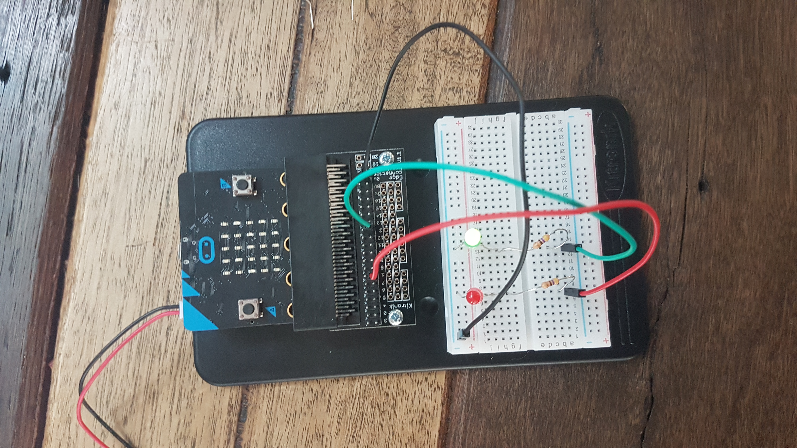

I've changed the on/off switch instead to be the A button on the micro:bit.

All I need to do now is add the buzzer.

The problem here is, once the required temperature was reached, the buzzer would not stop ringing. After looking up some discussions online, I realised I should just put in a 'stop melody' block. Which worked!

It's done! Here is the final code and circuitry.
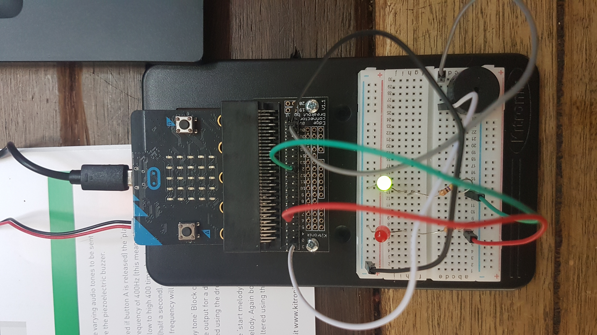

Now to make the box.
Here are some designs I've made for the box.
Whilst dismantling the box, I realised that it was joined with other pieces of cardboard, so I am doing the same. However, I don't have any hot glue or super glue, so I'm going to use sticky tape and staples. Sticky tape wasn't powerful enough, but on a trial piece of cardboard I found that staples were perfect. I'm going to add a small strip of cardboard to the front and back of each corner. 

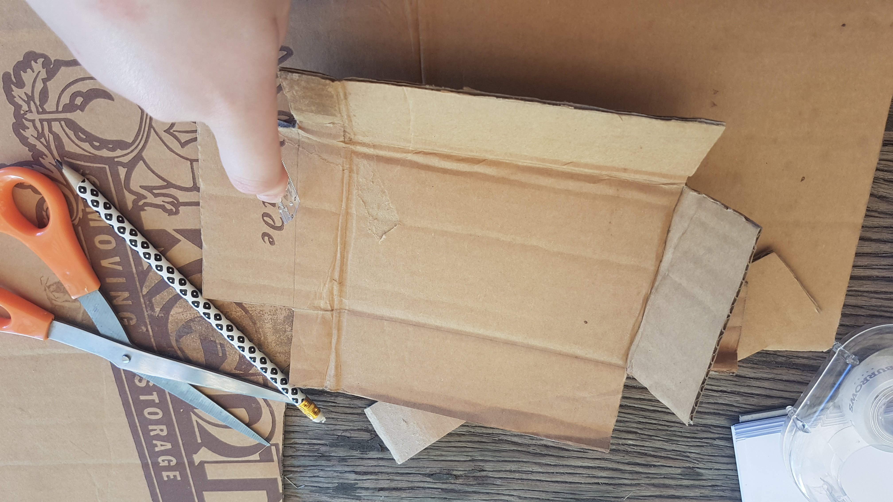
Cut out the bottom of the holding box. To create creases, I am using a ruler, otherwise the cardboard is too hard to fold accurately. 
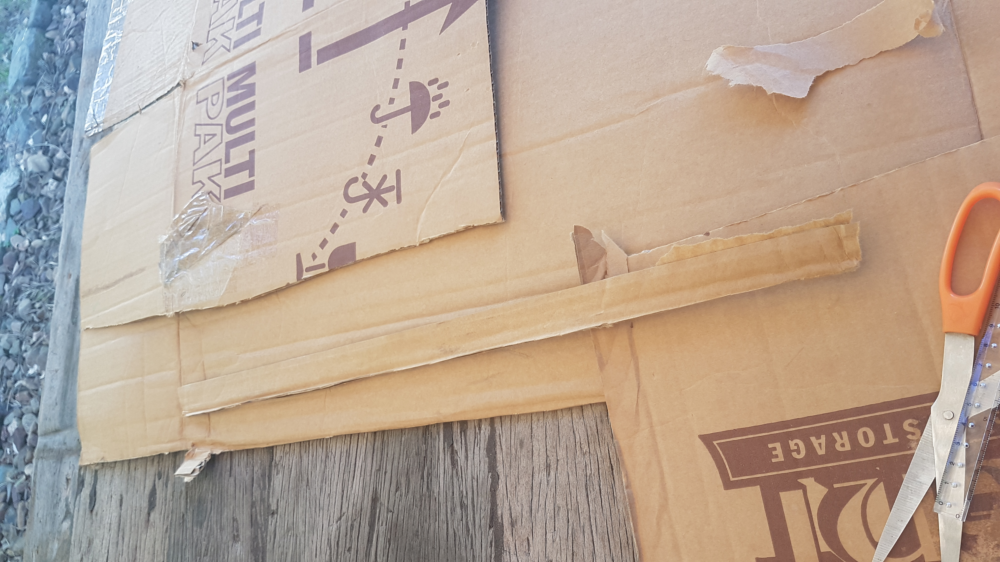
Strip for the supporting corner pieces.
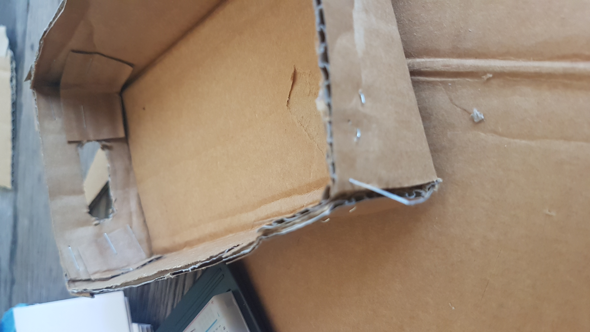
A close up of a corner.
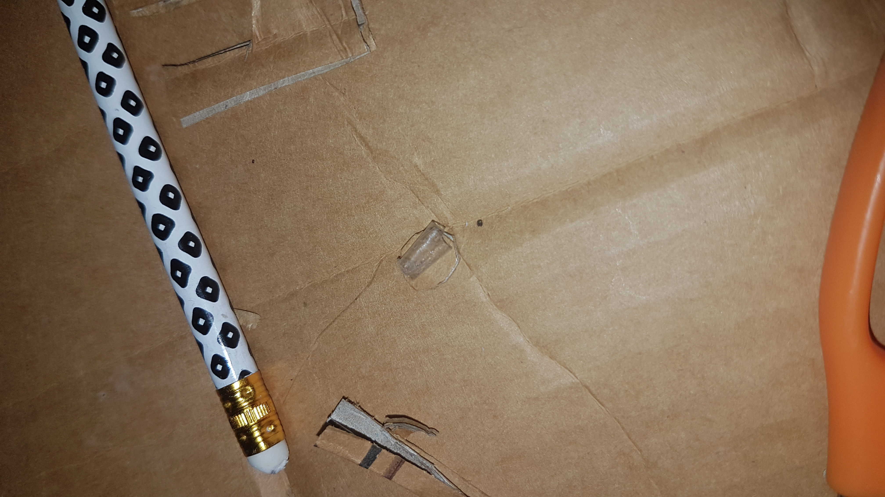
Whilst cutting out the lid, I realised it was too high up for the button to be pressed. So, I've made a button out of cardboard circles stacked on top of each other and attached with tape circled around to be double-sided.
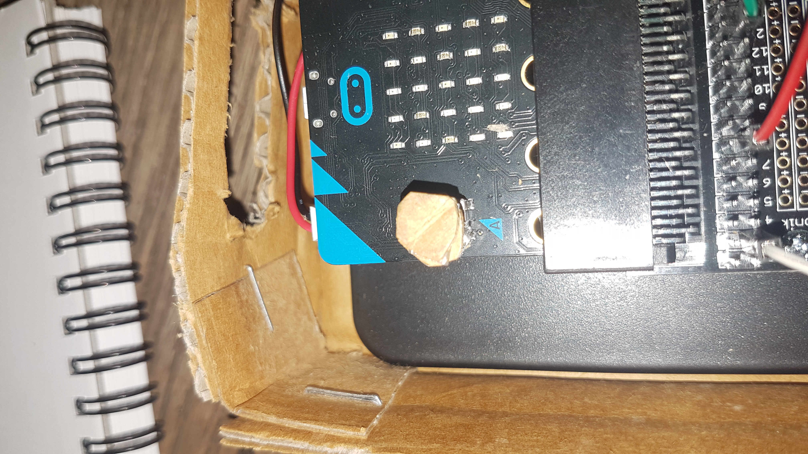

This is kind of weird, but it worked. I needed a precise location to cut out a hole for the lights. So I put bits of clumpy glue on each light and lightly pressed the lid onto it. It worked! 
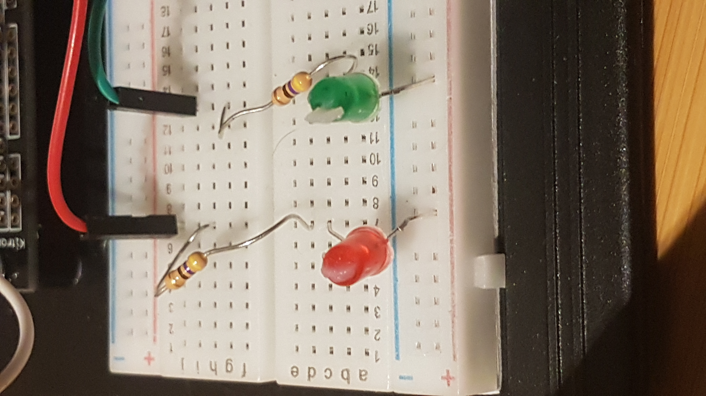
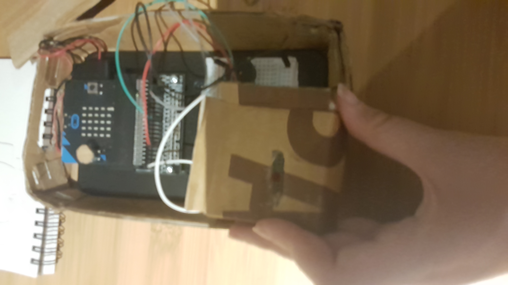

It's done!!!!!!!!!!!
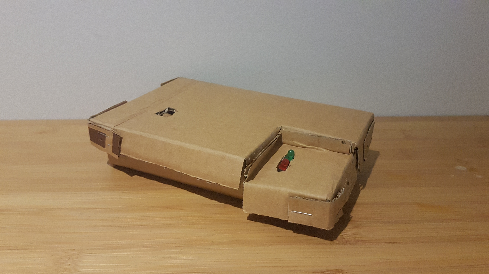

## Project outcome ##

### Project title ###
Pre-Sensor
### Project description ###

This is a sensor to prevent false positive smoke sensor alerts. This project is most useful in laundries and bathrooms. If the dryer is in danger of overheating, or if you forget to turn on your fan for your shower, or don't even have one, this sensor will let you know without the massive noise and potential evacuation an actual smoke alarm threatens. This project uses both simple visual and auditory to alert danger.
### Showcase image ###

*Try to capture the image as if it were in a portfolio, sales material, or project proposal. The project isn't likely to be something that finished, but practice making images that capture the project in that style.*

### Additional view ###
Its compact design means it can even fit in small spaces, making it unobtrusive and easily a part of the users lifestyle.
![Image]20200327_200845.jpg)

### Reflection ###

*Describe the parts of your project you felt were most successful and the parts that could have done with improvement, whether in terms of outcome, process, or understanding.*
I believe that my project was functoning and decently fabricated, considering it is a prototype and the limited materials I had on hand. I'm quite proud of how I made the outer casing fit and support the micro:bit. However, I do believe the project is somewhat lacking in complexity, and if I had a better understanding of circuitry I would have been able to include the middle light. I also would have preferred to have access to tools like alligator clips so the physical box would not have to look as clunky to facilitate the prototyping plate.

*What techniques, approaches, skills, or information did you find useful from other sources (such as the related projects you identified earlier)?*
Through the NeoPixel project I learnt the 'and' feature of the micro:bit coding. I was inspired to do a prevantative sensnor from the water sensor project. Inspired by the Baby G watch, I made a pretty cool seriers of emojis that changed on button press, but it's a shame it wasn't needed in the final product. 

*What ideas have you read, heard, or seen that informed your thinking on this project? (Provide references.)*
The Lovebox project definitely inspired me to think about how to interact with a project. https://en.lovebox.love/
I've also watched a lot of videos from the Youtube channel Technology Connections. https://www.youtube.com/channel/UCy0tKL1T7wFoYcxCe0xjN6Q. They talk about how various technologies work, and it has been very interesting to watch.

*What might be an interesting extension of this project? In what other contexts might this project be used?*
An interesting extension of this project would definitely be to add humidity sensors. Whilst it functions perfectly with the dryer, it has limited functionality in the shower, since it is based on the relationship heat has with steam levels, not the actual temperature. Adding a humidity sensor would test the amount of vapour in the air - which is what actually sets off the smoke detector - and would make the project far more effective.
